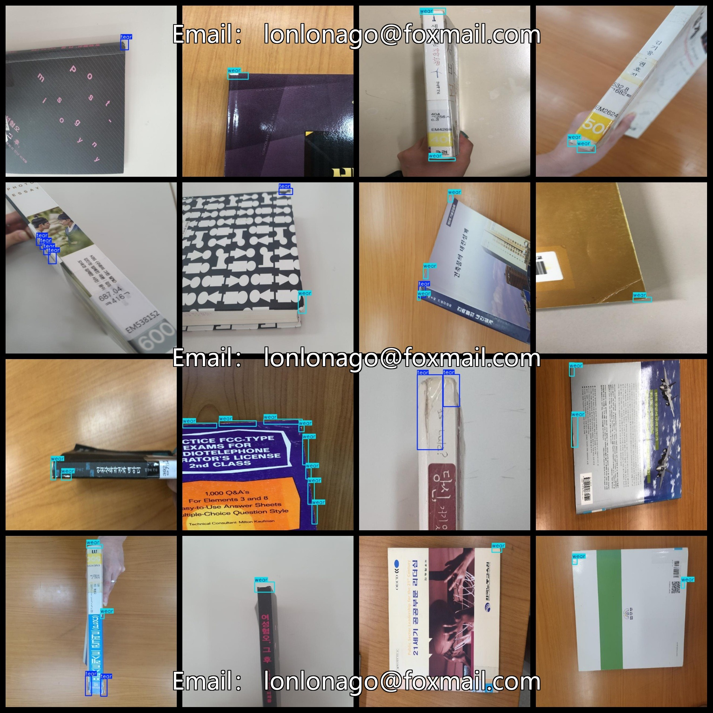
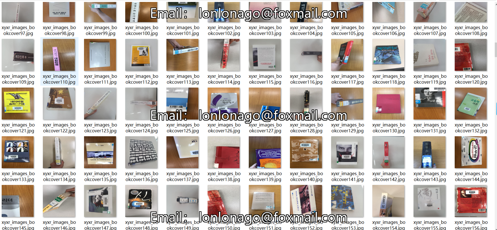

# Book Cover Defect Detection Dataset - 611 Images in VOC+YOLO Format

The dataset consists of 611 images in Pascal VOC format combined with YOLO format (excluding the split paths in the txt files, only containing jpg images along with corresponding VOC-format xml files and YOLO-format txt files).

Number of images (in jpg format): 611

Number of annotations (in xml format): 611

Number of annotations (in txt format): 611

Number of annotation categories: 2

Repository: datasets_sl

Annotation category names (note that the order of categories in the YOLO format does not match this, but is based on the labels folder's classes.txt): ["tear", "wear"]

Number of bounding boxes for each category:

- Tear bounding boxes = 423 (Tear)
- Wear bounding boxes = 1468 (Wear)

Total bounding boxes: 1891

Number of images per category:

- Tear images = 260
- Wear images = 551

Image resolution: 640x640

Annotation tool used: labelImg

Dataset enhancement status: No

Annotation rules: Draw a square bounding box around the category

Important Note: The dataset does not have been divided into training, validation, or testing sets; you will need to do so yourself.

Special Remark: This dataset does not guarantee any accuracy for models trained on it or weight files.

Annotation and image details are as follows:

## Images

---

Here is a pay link on Stripe (https://buy.stripe.com/3cs8yP7sY87d0vu9AB). Please contact me lonlonago@foxmail.com after funding $89, and I will send you a complete data files, thank you!

